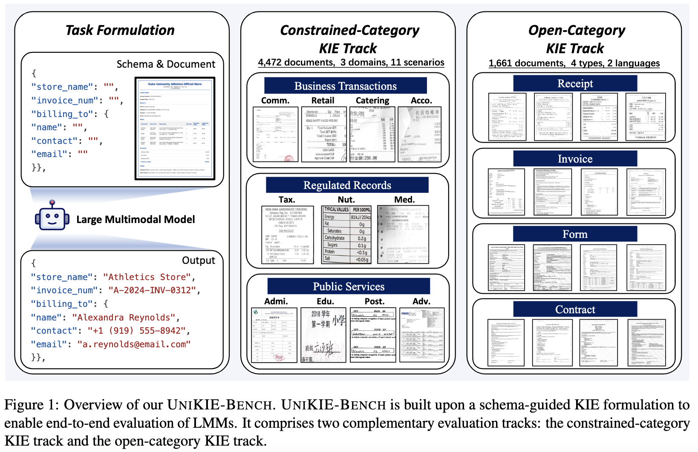
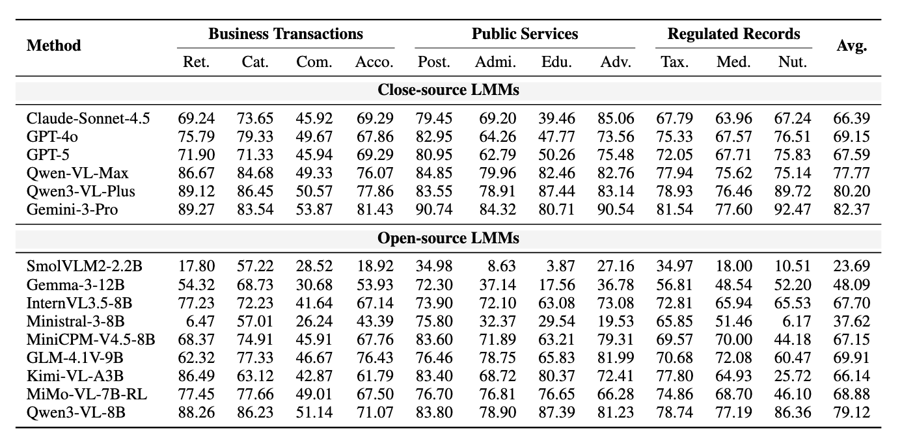
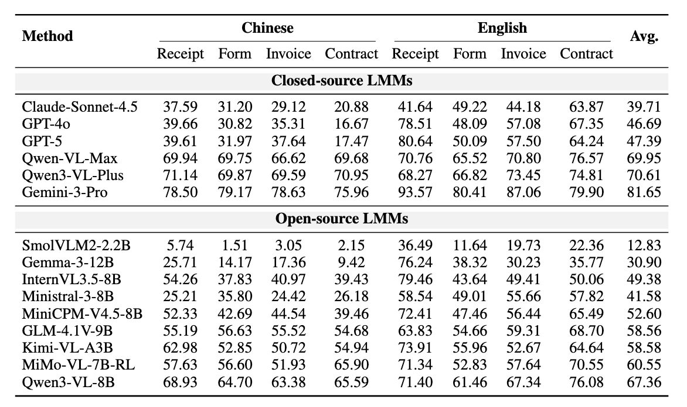

# UNIKIE-BENCH: Benchmarking Large Multimodal Models for Key Information Extraction in Visual Documents

<div align="center">

[](https://arxiv.org/abs/2602.07038)
[](https://github.com/NEUIR/UNIKIE-BENCH)

</div>

<p align="center">
 <a href="#-overview"> 📖 Overview </a> •
 <a href="#benchmark-results">📊 Benchmark Results</a> •
 <a href="#️-setup">⚙️ Setup</a> •
 <a href="#-data-preparation">📊 Data Preparation </a>
 <br>
 <a href="#-inference">🔧 Inference </a> •
 <a href="#-evaluation">📃 Evaluation </a> •
 <a href="#-citation">📝 Citation</a> •
 <a href="#-contact">📧 Contact</a>
</p>

## 📖 Overview

**UNIKIE-BENCH** is a unified benchmark designed to rigorously evaluate the Key Information Extraction (KIE) capabilities of Large Multimodal Models (LMMs) across realistic and diverse application scenarios.



## Benchmark Results

🔥 **Constrained-Category**



🔥 **Open-Category**




## ⚙️ Setup

**Install dependencies**
```bash
pip install -r requirements.txt
```

## 📊 Data Preparation

> **Note:** For detailed dataset processing instructions, please refer to [DATA_PROCESS](./DATA.md)

The processed datasets will be saved in the `datasets/` directory, with each 
folder containing:
- `label.json` 
- `qa.jsonl` 
- `images/`

Run after processing:
```bash
./scripts/download_constrained_category.sh # Constrained Category Dataset 
```

For Open Category, we provide a [Google Drive](https://drive.google.com/file/d/1UL73ne_YPxYDA64lC_dvSwGPxiaKy1JS/view?usp=drive_link) link for download.

## 🔧 Inference

This section covers how to run inference with various models using OpenAI API.

### Running Inference with OpenAI API

Use the `scripts/run_openai_api.sh` script to run inference on datasets, and you can also run inference directly using Python:

```bash
python src/request_openai.py [args]
```
**args:**
- `--dataset`: Dataset name (e.g. "Medical-Services")
- `--model`: Model name
- `--jsonl`: Path to qa.jsonl file (default: `datasets/<dataset>/qa.jsonl`)
- `--output`: Output jsonl path(default: `results/<dataset>/result_<model_name>.jsonl`)
- `--api-key`: OpenAI API key
- `--api-base`: OpenAI API base

You can use vLLM to deploy local models, for example: 

```bash
CUDA_VISIBLE_DEVICES=0,1 python -m vllm.entrypoints.openai.api_server --model xxx --served-model-name xxx --dtype=auto --tensor-parallel-size2 --trust_remote_code --gpu-memory-utilization 0.8 --api-key xxx
```

## 📃 Evaluation

After running inference, evaluate the results using the evaluation script.

### Using the Evaluation Script

Use the `scripts/eval.sh` script to evaluate multiple models.

Specify the dataset name in the script (Keep consistent with the names in the datasets folder):
```
DATASETS=(xxx)
```
and run:
```bash
./scripts/eval.sh <MODEL_NAME>
```
You can also run evaluation directly using Python:

```bash
python src/evaluate_results.py [args]
```

**OPTIONS args:**
- `--pred`: Prediction result JSONL file path (output from request_openai.py)
- `--dataset`: Dataset name (e.g. "Medical-Services")
- `--output`: Evaluation result output JSON file path (optional, default: `<pred_file>_eval.json`)

## 📝 Citation

If you find our work to be of value and helpful to your research, please acknowledge our contributions by citing us in your publications or projects:

```bibtex
@article{unikie2026,
  title={UNIKIE-BENCH: Benchmarking Large Multimodal Models for Key Information Extraction in Visual Documents},
  author={Yifan Ji and Zhipeng Xu and Zhenghao Liu and Zulong Chen and Qian Zhang and Zhibo Yang and Junyang Lin and Yu Gu and Ge Yu and Maosong Sun},
  journal={arXiv preprint arXiv:2602.07038},
  year={2026}
}
```

## 📄 License

This dataset is provided for academic research purposes only. The code in this repository is released under the MIT License. See the LICENSE file for details.


## 📧 Contact

If you have suggestions with the UniKIE benchmark, please contact us.
```
bigtailwolf001@gmail.com
```
